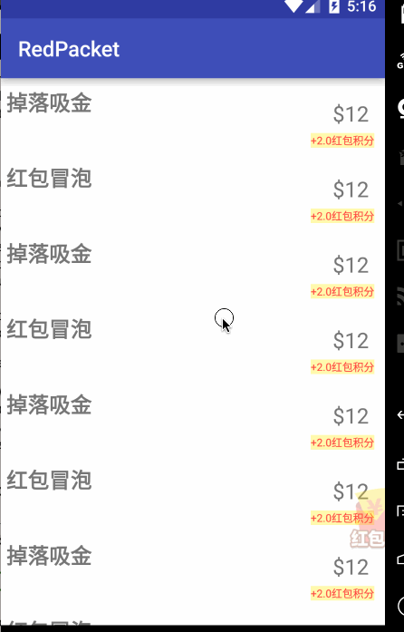

# 红包小标签

## Feature:

* 红包联动`RecyclerView`显示与消失
* 支持滑动让红包消失
* 支持吸入`View`动画(可自定义动画效果)
* 支持在红包上方添加冒泡动画(可自定义动画效果/冒泡位置)

## How to use

### RecyclerView Linkage

set `RedPacketView` in layout

```xml
 <com.mio4kon.library.RedPacketView
        android:id="@+id/red_packet"
        android:layout_marginBottom="70dp"
        android:layout_alignParentBottom="true"
        android:layout_alignParentRight="true"
        android:src="@mipmap/ico_red_packet"
        android:layout_width="wrap_content"
        android:layout_height="wrap_content" />
```

found `RedPacketView` and link `RedPacketView` to `RecyclerView`

```java
//inject RecyclerView
mRedPacketView.setRecyclerView(rv);
```

### suck view into RedPacket


```java
 View suckView = v.findViewById(R.id.tv_money);
 mRedPacketView.suck(suckView);
```

**note:** now only auto support `TextView`,if you want support suck ImageView or other view,you  use `supportOtherView4Suck(View view)` method,below are example of
this case:

```java
//use inflate xml to inflate no parent sucked view for support other view(ImageView..)
View suckedView = LayoutInflater.from(this).inflate(R.layout.view_image, null);
View orgSuckedView = v.findViewById(R.id.layout_image);
mRedPacketView.supportOtherView4Suck(suckedView);
mRedPacketView.suck(orgSuckedView);
```

### bubble view from RedPacket

```java
View bubbleView = LayoutInflater.from(this).inflate(R.layout.view_scores, null);
mRedPacketView.bubble(bubbleView);
```

## screenshot




## License

	Copyright 2016 mio4kon

    Licensed under the Apache License, Version 2.0 (the "License");
    you may not use this file except in compliance with the License.
    You may obtain a copy of the License at

       http://www.apache.org/licenses/LICENSE-2.0

    Unless required by applicable law or agreed to in writing, software
    distributed under the License is distributed on an "AS IS" BASIS,
    WITHOUT WARRANTIES OR CONDITIONS OF ANY KIND, either express or implied.
    See the License for the specific language governing permissions and
    limitations under the License.


